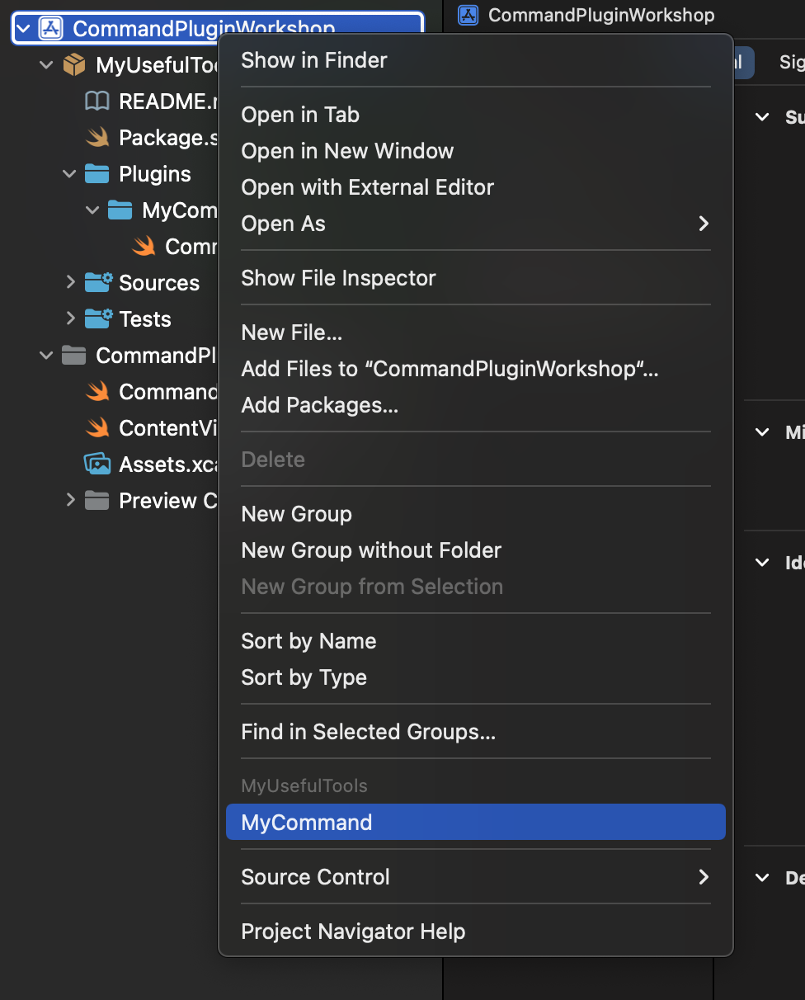
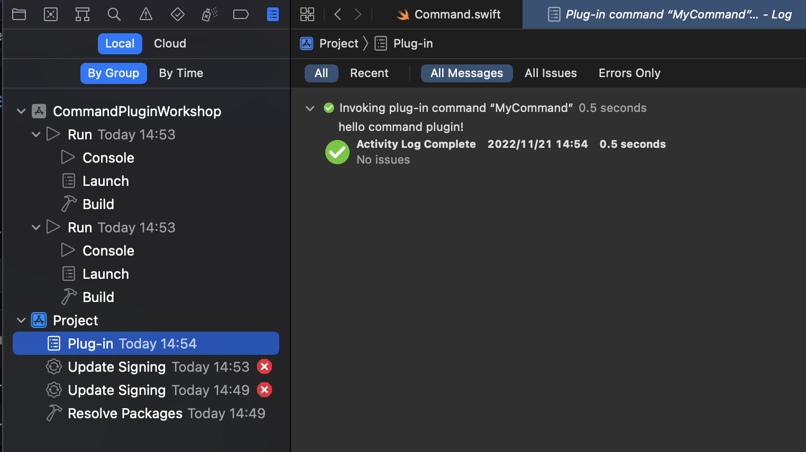

# Instruction

## 1. Clone this repository

## 2. Open `./CommandPluginWorkshop.xcodeproj`

## 3. Run MyUsefulTool

Right Click on `CommandPluginWorkshop` on top of the file tree.

Press `Allow command to change files`.

## 4. `hello.txt` will be generated on project directory

TIPS : You can see `print` logs on build result. (Not console)

